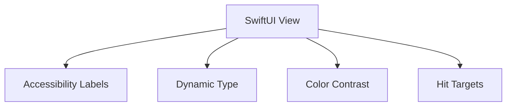

# Accessibility

This document defines accessibility expectations for a product-ready iOS app.

Apple references (conceptually): Dynamic Type, VoiceOver, contrast, motion, and input modalities.

---

## Goals

- All primary flows must be usable with **VoiceOver**.
- Text must scale with **Dynamic Type** without truncation in critical UI.
- Interactive targets must meet minimum hit size.

---

## Current Project Notes

- The app uses SwiftUI, which provides strong baseline accessibility.
- Some screens use custom fonts and gradients; these require extra attention to contrast and scaling.

---

## Dynamic Type

Guidelines:

- Prefer semantic fonts (e.g., `.title`, `.body`) for most text.
- When using `.custom(...)`, validate scaling.

Recommended approach:

- Use `@ScaledMetric` for sizes that must scale.

Checklist:

- [ ] Test with Accessibility → Larger Text
- [ ] Ensure no critical buttons become inaccessible due to truncation

---

## VoiceOver

Guidelines:

- Add accessibility labels for icon-only buttons.
- Combine related text into a single accessible element when needed.

Examples:

- Tab bar buttons should have a label like “Home tab”
- Decorative images should be hidden from accessibility tree

SwiftUI tools:

- `.accessibilityLabel("...")`
- `.accessibilityHint("...")`
- `.accessibilityHidden(true)`

---

## Color & Contrast

Guidelines:

- Do not rely solely on color to indicate state.
- Validate gradients against both light and dark backgrounds.

The project defines dynamic surfaces in `Theme/AppColors.swift` — use them instead of raw black/white.

---

## Reduce Motion

If you add large animations:

- Respect “Reduce Motion” settings.
- Avoid critical information that depends solely on animation.

---

## Keyboard & Input

Guidelines:

- Ensure form fields have clear labels.
- Support return-key behavior (Next/Done) where applicable.

---

## Testing Checklist (Practical)

- VoiceOver: navigate Login → Main tabs → Settings
- Dynamic Type: Largest size, verify layout still works
- Dark Mode: verify contrast on cards, buttons, tab bar

---

## Diagram: Accessible UI Contract

