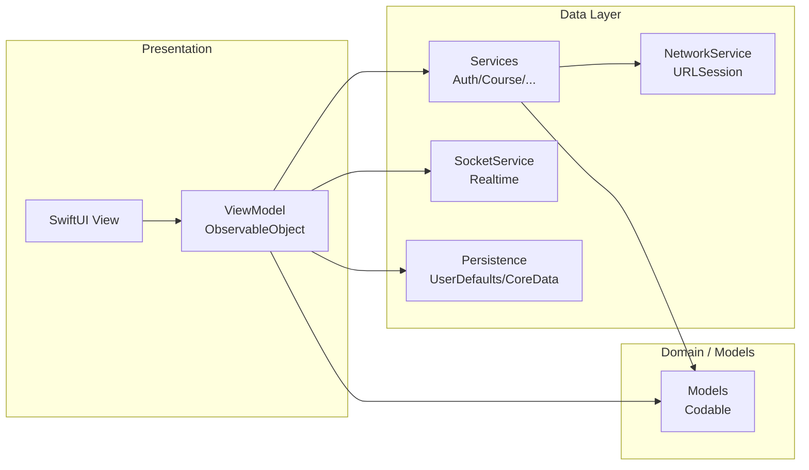

# Architecture

## Goals

The architecture is designed to:

- Keep UI code **simple and declarative** (SwiftUI-first)
- Make business logic **testable** (ViewModels with injected dependencies)
- Reduce coupling between features (clear folder boundaries)
- Ensure APIs are centralized and consistent (Services + shared `NetworkService`)

---

## Chosen Architecture: MVVM + Services + DI

This project uses **MVVM (Model–View–ViewModel)** with a dedicated **Services layer** and a centralized **Dependency Injection container**.

Why this choice works well for SwiftUI:

- SwiftUI encourages **state-driven UI**, which maps naturally to ViewModels.
- ViewModels can be `ObservableObject` and expose `@Published` properties.
- Services isolate networking and external concerns, keeping ViewModels focused.

---

## Responsibilities

### View (SwiftUI)

A View:

- Renders UI based on state
- Forwards user intent to its ViewModel
- Owns transient UI state only (presentation, focus, local toggles)

**Rules:**

- No API calls
- No endpoint strings
- No token logic

### ViewModel

A ViewModel:

- Owns screen state (`@Published`) and validation
- Calls Services to perform use cases
- Translates service results into UI state

**Rules:**

- No SwiftUI layout code
- Avoid global mutable state
- All dependencies must be injected (directly or via `DIContainer` factory)

### Model

Models are `Codable` structures representing:

- API payloads
- Domain entities used by Views/ViewModels

### Service

Services:

- Encapsulate a feature domain API surface (e.g., `AuthService`, `CourseService`)
- Construct endpoints and headers
- Call the shared `NetworkService` for requests

---

## Dependency Injection

Dependencies are centralized in `DIContainer`:

- Instantiates shared services once
- Ensures correct initialization order
- Exposes factory methods for ViewModels

This improves:

- **Testability** (swap real services with mocks)
- **Consistency** (single source for wiring)
- **Maintainability** (clear dependency graph)

---

## Architecture Diagram

---

## Root Routing & App Shell

The app’s root logic lives in `projectDAMApp.swift`:

- Uses `@AppStorage("isLoggedIn")` to choose authentication vs main shell
- Loads fresh user data on startup when possible
- Uses `RoleManager` to select Student / Teacher / Admin tab shells

See: [Navigation-and-Routing.md](Navigation-and-Routing.md)

---

## Testability Notes

- Services define protocols (e.g., `AuthServiceProtocol`), enabling mocks.
- ViewModels should depend on protocols, not concrete types.

See: [Testing.md](Testing.md)
