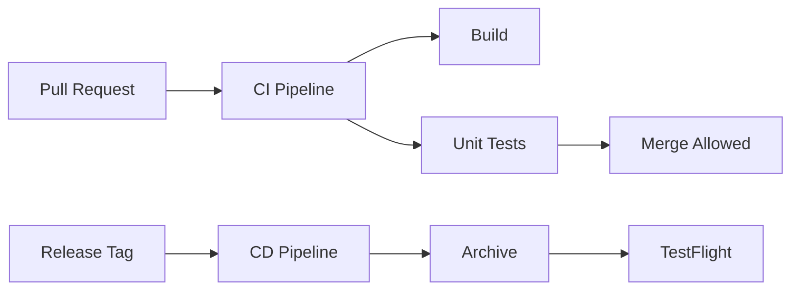

# CI/CD

This document describes a product-ready CI/CD philosophy for the iOS project.

> CI/CD may not be fully implemented in this repository yet; this is the recommended standard.

---

## Goals

- Every pull request runs a predictable build + test pipeline.
- Code health stays visible (tests, lint, warnings-as-errors where possible).
- Releases are reproducible and traceable.

---

## Recommended Pipeline

### Continuous Integration (CI)

On each PR:

1. Checkout
2. Resolve dependencies (Swift Package Manager)
3. Build the app target
4. Run unit tests
5. (Optional) Run UI smoke tests

### Continuous Delivery (CD)

On release branch/tag:

1. Build with Release configuration
2. Archive
3. Export IPA
4. Upload to TestFlight

---

## Build Matrix

Recommended:

- iOS Simulator (latest)
- One additional simulator version if you support older iOS

---

## Secrets Management

- Store secrets in CI secret storage (never in Git).
- Do not commit `Config.local.xcconfig`.

---

## Quality Gates

Recommended gates:

- Tests must pass
- No new warnings
- Basic static checks (SwiftLint if adopted)

---

## Example (High-Level) Mermaid

---

## Suggested Tools

- GitHub Actions (common)
- Xcode Cloud (Apple-native)
- Fastlane (automation)

---

## Notes for This Project

If you implement CI for this repo later:

- Start with build + unit tests.
- Add signing/export after the team agrees on release process.
