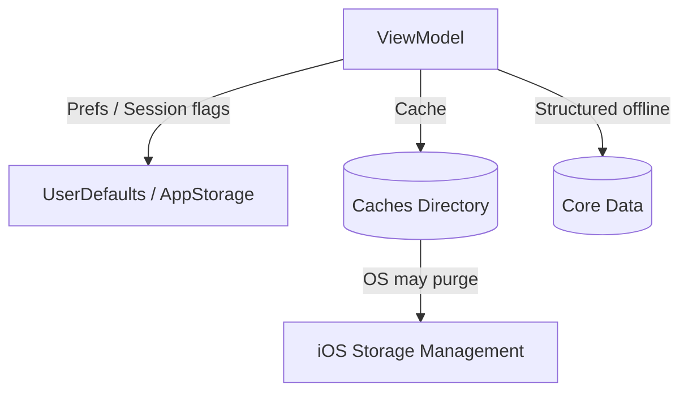

# Data Persistence

This document describes how the app stores data locally and what guarantees it provides.

---

## Persistence Categories

### 1) Session and Preferences

Current implementation uses:

- `@AppStorage("isLoggedIn")` and `@AppStorage("isDarkMode")` for simple flags
- `UserDefaults` for:
  - `authToken` (JWT)
  - logout marker (`userDidLogout`)
  - local values like `pendingInviteCode`

This is easy to work with, but sensitive values like tokens should ideally be stored in Keychain.

See: [Security.md](Security.md)

---

### 2) Disk Cache (Non-sensitive)

The project includes file-based caching in the **Caches directory**.

#### Home dashboard cache

- `HomeCacheStore` writes JSON envelopes to Caches.
- Envelope includes `savedAt` to support freshness rules.

Characteristics:

- Intended to improve perceived performance and resilience
- Safe to delete (Caches may be purged by the OS)

#### Teacher course content cache

- `TeacherCourseContentCache` stores payloads per `courseId` + access scope.
- Uses a background queue (`utility`) for disk writes.

Characteristics:

- Supports offline usage patterns for cached lesson content
- Cache invalidation is currently based on replacement (overwrite)

---

### 3) Core Data (Scaffold)

The project includes a `PersistenceController` and a Core Data model (`projectDAM.xcdatamodeld`).

Current state:

- The Core Data stack exists and is injected into the SwiftUI environment.
- Some template/sample usage exists (`ContentView`).

Product note:

- Core Data should be used for structured offline storage when you need:
  - complex queries
  - relational data
  - offline-first screens

If Core Data becomes a core part of the product, the project should define:

- a clear set of entities
- migration strategy
- background context rules

---

## Storage Decision Matrix

| Type of Data | Recommended Storage | Reason |
|---|---|---|
| Access token (JWT) | Keychain | Sensitive, must be encrypted and protected |
| User preferences (dark mode) | `@AppStorage` | Simple and safe |
| Cacheable API responses | Caches directory | Fast, purgeable by OS |
| Offline-first structured data | Core Data | Queryable and persistent |

---

## Data Lifetime & Eviction

- **UserDefaults**: persists until removed by app/uninstall.
- **Caches**: can be removed by the OS at any time.
- **Core Data**: persists until app/uninstall; must handle migrations.

---

## Guidelines

- Never store passwords.
- Do not store tokens in plain text if the threat model includes device compromise.
- Use caches for performance; do not rely on caches for correctness.

---

## Diagram

