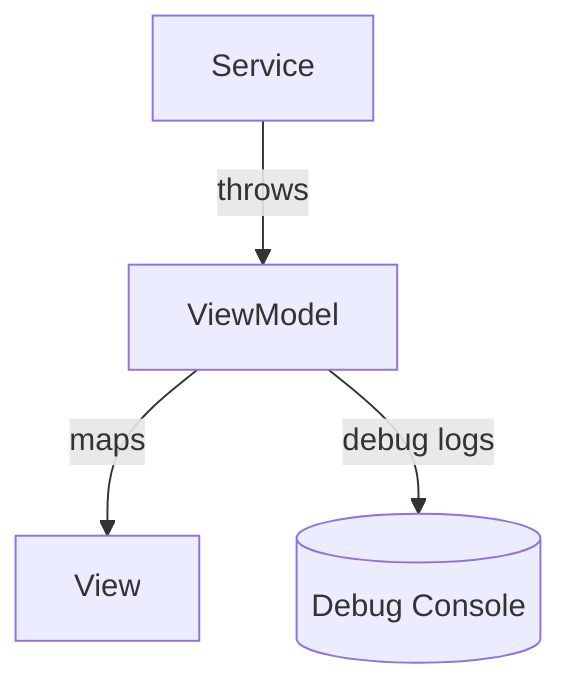
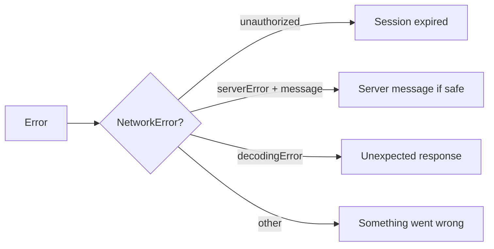

# Error Handling

This document defines how errors are represented, propagated, and displayed.

---

## Principles

- Errors must be **actionable**: give the user a next step.
- Prefer **user-friendly messages** over raw technical strings.
- Log technical details in Debug; keep Release logs minimal.

---

## Error Sources

### Networking errors

`NetworkService` throws `NetworkError`:

- `unauthorized` (HTTP 401)
- `serverError(code, message)` (non-2xx)
- `decodingError`
- `invalidURL`, `invalidResponse`

### Business rule errors

ViewModels may validate inputs and produce errors without any network request.

Example:

- invalid email format
- password does not meet constraints

### Realtime/session errors

Socket layer can produce:

- connection failures
- server-driven session termination

---

## Propagation Strategy

- Services throw errors.
- ViewModels catch and map errors into:
  - `errorMessage` (String?)
  - retry states (`isLoading`, `isRefreshing`)
- Views display errors via `.alert` or inline error UI.

---

## Unauthorized (401) Handling

Behavior:

- Treat 401 as “session invalid”.
- Ensure the UI returns to Login and clears session state.

Current implementation includes a strong session termination flow via sockets.

Recommended addition (if needed):

- centralize 401 handling to avoid repeating logic across ViewModels

---

## User-Facing Error Copy Guidelines

Use Apple-style clarity:

- “Please check your internet connection and try again.”
- “Your session expired. Please sign in again.”

Avoid:

- raw server errors
- stack traces
- internal codes

---

## Debug vs Release

- Debug: log status codes, endpoints, decoding failures.
- Release: do not log sensitive payloads.

See: [Security.md](Security.md)

---

## Crash Avoidance

The codebase still contains a few `fatalError` calls in:

- Core Data scaffolding
- Some UIKit adapter initializers

Production guideline:

- Replace fatal crashes with recoverable error handling where feasible.

---

## Recommended Standard Pattern (ViewModel)

Pseudo-pattern:

- set `isLoading = true`
- `defer { isLoading = false }`
- `do/try/await` service call
- catch and map to user-friendly message

---

## Diagram: Error Mapping

