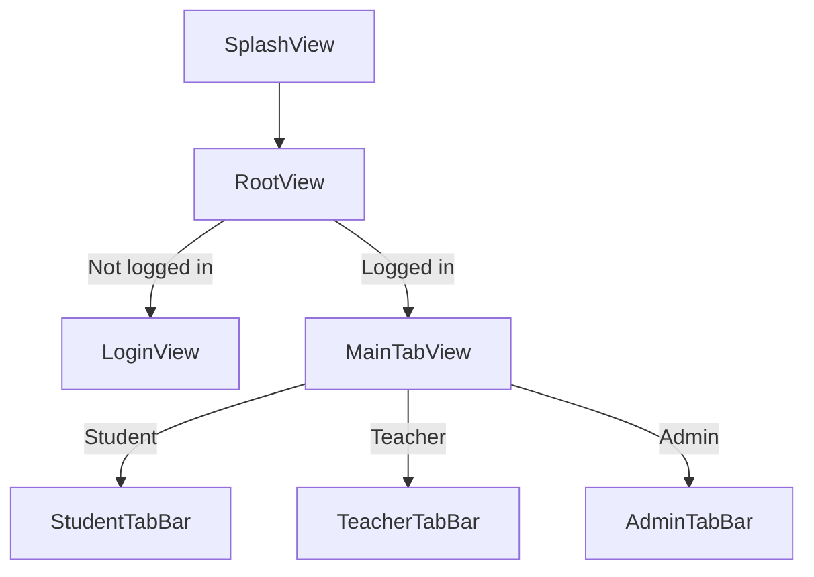

# Navigation and Routing

This app uses **SwiftUI navigation** with a small UIKit bridge for consistent navigation-bar appearance.

---

## High-Level Routing

Routing is role- and session-driven.

1. `projectDAMApp` displays a splash screen.
2. `RootView` decides whether to show:
   - Authentication flow (Login)
   - Main app shell (`MainTabView`)
3. The user’s role selects one of the tab configurations:
   - Student
   - Teacher (mentor)
   - Admin

---

## Navigation Container

The project defines `AppNavigationContainer`:

- iOS 16+: uses `NavigationStack`
- iOS 15: uses `NavigationView` with stack style

This ensures modern navigation APIs are used where available while preserving compatibility.

---

## Tab Shell

`MainTabView` is the central role-based shell.

- Maintains selected tab per role
- Wraps each tab root in `AppNavigationContainer { ... }`
- Supports hiding/showing the tab bar via a PreferenceKey

### Programmatic tab switching

The app uses `NotificationCenter` for tab-switch requests:

- `TeacherTabSwitchRequest`
- `StudentTabSwitchRequest`
- `AdminTabSwitchRequest`

This is used when a screen in one feature wants to switch tabs without tightly coupling to the tab view.

Guideline:

- Prefer explicit navigation APIs within a feature.
- Use notifications only for **cross-feature shell coordination**.

---

## Session-Driven Navigation

A session can be terminated server-side (via Socket.IO events). When this happens:

- `SocketService` publishes the event
- `RootView` listens via `NotificationCenter`
- `SessionManager` shows a session termination alert
- App logs out and returns to Login

See:

- [State-Management.md](State-Management.md)
- [Error-Handling.md](Error-Handling.md)

---

## Navigation Bar Styling

Navigation bar style is centralized through `appNavigationBarStyle` and a UIKit configurator.

Rationale:

- SwiftUI’s navigation chrome can differ between iOS versions.
- Centralization avoids per-screen appearance inconsistencies.

---

## Recommendations (Product-Ready)

- Prefer `NavigationStack` + typed `NavigationPath` for new features.
- Keep routing state in the feature domain when possible.
- Avoid deep-link string parsing in Views; isolate in a routing layer if added.
