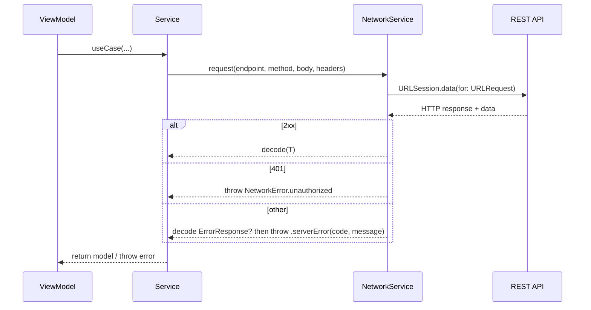

# Networking

This project uses a lightweight networking layer built on top of `URLSession` and Swift Concurrency.

Primary sources:

- `projectDAM/Services/NetworkService.swift`
- `projectDAM/Services/NetworkService+Debug.swift`
- Feature services under `projectDAM/Services/*Service.swift`

---

## Goals

- One consistent API entry point for all REST requests
- Predictable error mapping for UI
- Easy mocking for tests
- Simple to extend (multipart uploads, additional headers)

---

## Building Blocks

### `NetworkServiceProtocol`

The protocol defines two operations:

- `request<T: Decodable>(...) async throws -> T`
- `upload<T: Decodable>(...) async throws -> T`

This allows injecting a mock network implementation into services when testing.

### `NetworkService`

Implementation details:

- Base URL comes from `AppConfig.baseURL`
- Uses `URLSession.data(for:)` with async/await
- Default header: `Content-Type: application/json`
- Custom headers can be added per request (e.g., `Authorization: Bearer <token>`)

---

## Request Lifecycle

---

## Error Model

The project defines `NetworkError`:

- `invalidURL`
- `invalidResponse`
- `decodingError`
- `serverError(Int, String?)`
- `noData`
- `unauthorized`

UI strategy:

- ViewModels translate errors into user-facing messages.
- 401 → treat as an authentication/session issue.

See: [Error-Handling.md](Error-Handling.md)

---

## Authentication Header

Most protected endpoints use:

- `Authorization: Bearer <token>`

Current token source:

- `AuthService.getAuthToken()` (stored in `UserDefaults`)

Security note:

- `UserDefaults` is convenient but not ideal for sensitive tokens.
- See [Security.md](Security.md) for a product-grade approach.

---

## Debug Logging

`NetworkService+Debug.swift` supports request/response logging.

Guidelines:

- Logging should be enabled in Debug only.
- Never print tokens or private user data in production logs.

---

## Multipart Uploads

`NetworkService.upload(...)` supports multipart form uploads via a `MultipartFormData` builder.

If you add more upload endpoints:

- Keep boundary generation and content-type consistent
- Keep uploads in Services (not Views)

---

## Best Practices (Apple + Industry)

- Use `async/await` over Combine networking unless needed.
- Prefer typed models and decoding over manual JSON parsing.
- Keep all endpoint strings within the Services layer.
- Introduce request retry logic only when justified (idempotent operations).
