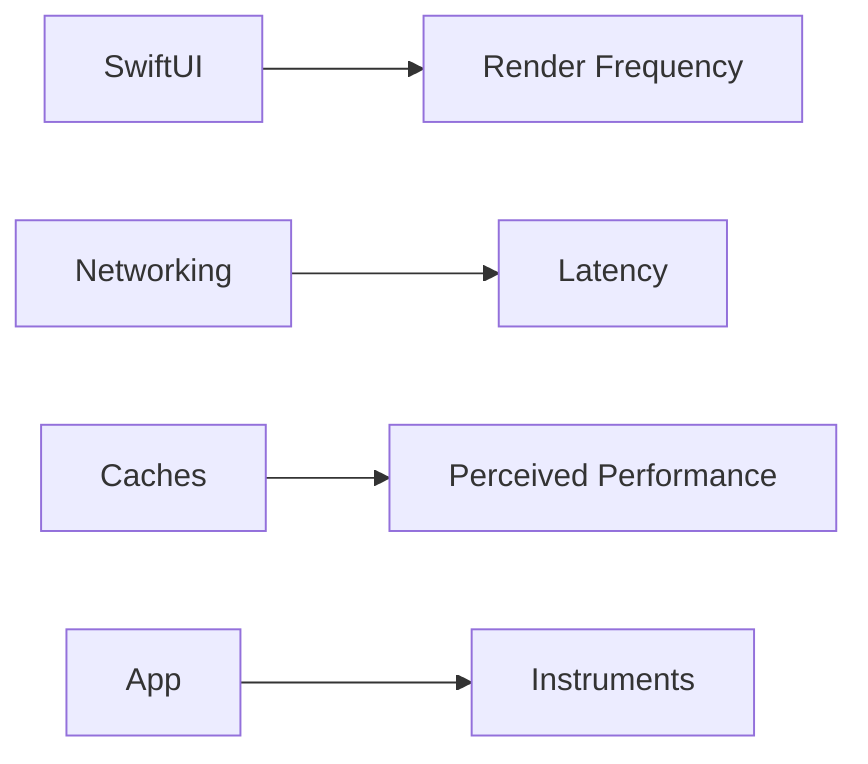

# Performance

This document defines performance practices for a product-ready SwiftUI application.

---

## Key Principles

- Avoid unnecessary re-renders.
- Keep network work off the main thread (async/await helps).
- Cache where appropriate, but do not compromise correctness.

---

## SwiftUI Performance

### Avoid excessive state

- Keep `@State` minimal.
- Use ViewModels to centralize state.

### Reduce view invalidations

- Prefer stable identifiers in lists.
- Avoid expensive computations in `body`.

### Images

- Use appropriately sized assets.
- Avoid decoding huge images on the main thread.

---

## Networking Performance

- Prefer batched endpoints when possible.
- Use caching for dashboard payloads where it improves UX.

Current caches:

- `HomeCacheStore` (caches directory)
- `TeacherCourseContentCache` (caches directory)

See: [Data-Persistence.md](Data-Persistence.md)

---

## Realtime (Socket) Performance

- Maintain heartbeat intervals responsibly.
- Avoid reconnect loops when user explicitly logged out.

The project’s `SessionManager` checks `shouldAutoLogin()` before reconnect.

---

## Launch Performance

- Keep `init()` of app entry lightweight.
- Avoid blocking work on the main thread.

---

## Memory & Storage

- Prefer Caches directory for purgeable files.
- Avoid storing large payloads in UserDefaults.

---

## Instrumentation

Recommended tools:

- Instruments → Time Profiler
- Instruments → Allocations
- Instruments → Network

---

## Practical Checklist

- [ ] Scroll-heavy screens remain smooth (60fps target)
- [ ] No repeated network calls on view appearance without need
- [ ] Caches used for large payloads, not secrets

---

## Diagram

