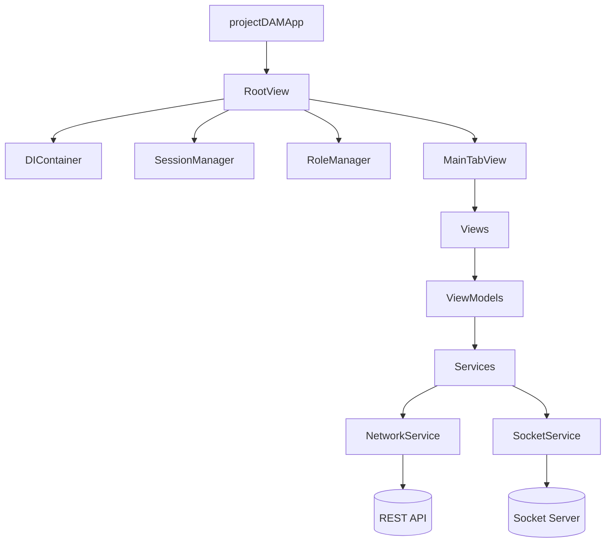

# Project Overview

## Purpose

The **TacheLik iOS** app is the native iOS client for the TacheLik learning platform. It delivers a role-based experience for:

- **Students**: learning content, quizzes, progress, messaging
- **Teachers (Mentors)**: dashboard, class management, analytics
- **Admins**: administrative dashboard and related tooling

The project is designed to be **maintainable, testable, and product-ready**, following Apple and industry best practices.

---

## Key Product Flows

### Authentication & Session

- Login / signup
- Email verification (including **6-digit verification code** flow)
- Password reset (including **6-digit reset code** flow)
- Automatic session restoration
- Session termination handling (server-driven via sockets)

### Role-Based App Shell

After authentication, the app routes the user to the correct role area:

- Student → Student tab bar
- Teacher (mentor) → Teacher tab bar
- Admin → Admin tab bar

The role is derived from the `User` model and managed by `RoleManager`.

### Real-time Features

- Socket connection is established after login and authenticated with the bearer token.
- Session termination events are delivered via NotificationCenter and surfaced as an alert.

---

## Non-Goals (to keep boundaries clear)

- Views should not define networking behavior or API endpoints.
- ViewModels should not depend on global mutable state.
- Services should not render UI or maintain view state.

---

## Where to Look First (for new developers)

1. App entry and root routing: `projectDAMApp.swift`
2. Dependency wiring: `projectDAM/DI/DIContainer.swift`
3. Networking baseline: `projectDAM/Services/NetworkService.swift`
4. Auth and token handling: `projectDAM/Services/AuthService.swift`
5. Role-based shell: `projectDAM/Views/Main/MainTabView.swift`
6. Design tokens: `projectDAM/DesignSystem.swift`, `projectDAM/Theme/*`

---

## High-Level Dependency Graph

---

## Terminology

- **View**: SwiftUI screen/component.
- **ViewModel**: state holder for a view; translates user intent into service calls.
- **Service**: API client abstraction for a feature domain.
- **DI**: dependency injection (dependencies are passed, not created ad-hoc).

See also: [Glossary.md](Glossary.md)
