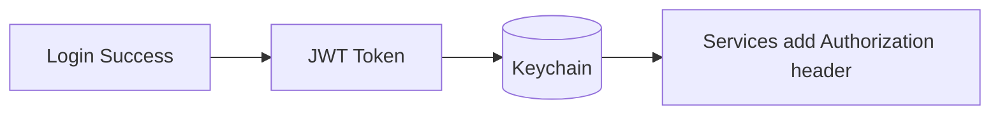

# Security

This document describes the security posture of the iOS client and recommended product-ready practices.

> Security is a spectrum. This document distinguishes **current implementation** from **recommended hardening**.

---

## Threat Model (Practical)

Typical threats for a mobile client:

- Token leakage from logs or local storage
- Man-in-the-middle interception on unsafe networks
- Session hijacking (token reuse on another device)
- Insecure backend URL configuration
- Sensitive UI exposure in app switcher screenshots

---

## Current Implementation

### Authentication tokens

- JWT token is stored in `UserDefaults` under `authToken`.

**Risk:**

- `UserDefaults` is not designed for secrets; extraction is easier on compromised devices.

### Transport Security (ATS)

`Info.plist` currently contains:

- `NSAllowsArbitraryLoads = true`

**Risk:**

- This weakens App Transport Security protections.

### Socket authentication

- Socket authenticates by emitting `token` + `browserFingerprint`.
- Session termination is handled server-side and surfaced to the user.

---

## Product-Ready Recommendations

### 1) Store tokens in Keychain (Recommended)

Use Keychain for:

- access token
- refresh token (if used)

Guidelines:

- Use `kSecClassGenericPassword`
- Use an access group only if needed
- Prefer `kSecAttrAccessibleAfterFirstUnlockThisDeviceOnly` for most tokens

Migration plan:

- Read token from Keychain first
- If not found, fall back to `UserDefaults` once
- On success, migrate to Keychain and delete from `UserDefaults`

### 2) Restore ATS protections

Recommended production posture:

- Remove `NSAllowsArbitraryLoads`.
- Use HTTPS endpoints.
- If development requires HTTP, limit exceptions to debug builds or specific domains.

### 3) Avoid logging secrets

Rules:

- Never print bearer tokens.
- Avoid printing raw JSON responses that may contain personal data.

### 4) Privacy by design

- Minimize stored personally identifiable information (PII).
- Do not cache sensitive payloads in the Caches directory.

### 5) Screenshot / App Switcher privacy (optional)

For sensitive screens (payments, personal info), consider:

- `UIApplication.shared.isProtectedDataAvailable`
- custom “blurred” overlay when app goes to background

---

## Session Security

The app uses a `SessionManager` to:

- reconnect sockets only if user did not explicitly log out
- terminate sessions on server signal

This prevents “silent re-login” after an explicit logout.

---

## Checklist

- [ ] Keychain storage for tokens
- [ ] ATS strict in Release
- [ ] No secrets in logs
- [ ] App privacy review (cached data and analytics)

---

## Diagram: Auth Token Storage (Recommended)

