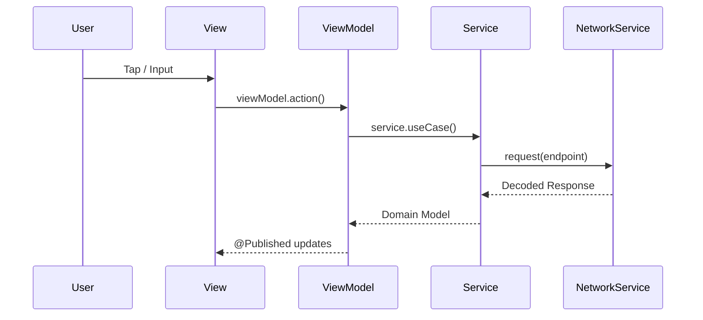

# State Management

This project uses SwiftUI’s state system with MVVM ViewModels.

---

## State Sources

### View-local state

Used for UI-only concerns:

- `@State` for local toggles, sheet presentation, animations
- `@FocusState` (if used) for focus management

### Shared app state

Used for cross-screen concerns:

- `@AppStorage("isLoggedIn")` and `@AppStorage("isDarkMode")`
- `@EnvironmentObject`:
  - `SessionManager` (session termination, socket reconnect)
  - `RoleManager` (role-based routing)

### ViewModel state

Each screen typically has a ViewModel:

- `@StateObject` in the View to own lifecycle
- `@Published` properties for UI binding

---

## Data Flow

A typical user interaction:

1. User taps a button in a View.
2. View calls a ViewModel method.
3. ViewModel calls a Service.
4. Service performs network request and returns a decoded model.
5. ViewModel updates `@Published` state.
6. SwiftUI re-renders the View.

---

## Session State

`SessionManager` coordinates:

- Socket reconnection after login
- Session termination handling

Important rule:

- Session state changes must result in clear UI outcomes (alert + logout).

---

## Role State

`RoleManager`:

- Publishes `currentRole`
- Helps `MainTabView` pick the correct tab configuration

---

## Concurrency Model

The project uses `async/await` for networking.

Guidelines:

- UI updates happen on the main actor.
- Avoid updating published state from background threads.

---

## Recommended Improvements (Future)

- Consolidate user/session state into a single `AppStore` if the app grows significantly.
- Prefer typed navigation state with `NavigationPath` for complex flows.
