<div align="center">

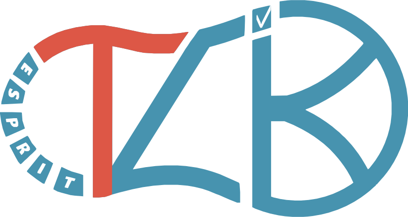

# TacheLik iOS

### A premium iOS learning experience — built with SwiftUI, MVVM, and real-time capabilities.

<p>
  <a href="#screenshots">Screenshots</a> •
  <a href="#architecture">Architecture</a> •
  <a href="#getting-started">Getting Started</a> •
  <a href="#documentation">Documentation</a> •
  <a href="#team--contributors">Team</a>
</p>


</div>

---

## 🚀 Overview

**TacheLik iOS** is the native iOS client for the TacheLik platform. It delivers a role-based learning experience (**Student / Teacher / Admin**) with:

- Fast, modern SwiftUI UI
- Secure authentication and verification flows
- Real-time interactions via Socket.IO
- Feature modularity through MVVM + Services + DI

---

## ✨ Core Features

- Role-based app shell (Student / Teacher / Admin)
- Authentication + email verification (including 6-digit code flows)
- Real-time session state + messaging foundations (Socket.IO)
- Caching for resilience and performance (Caches directory)
- Consistent theming and navigation appearance across iOS versions

---

## 📱 Screenshots

Key screens (most representative flows across roles):

<div style="overflow-x:auto;">
  <table>
    <tr>
      <td>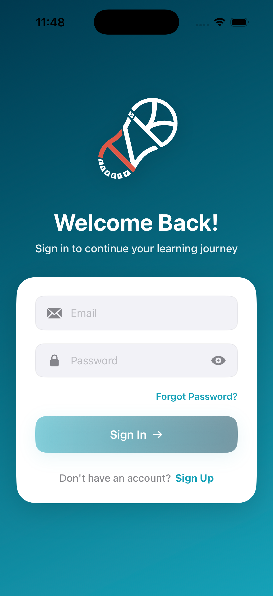</td>
      <td>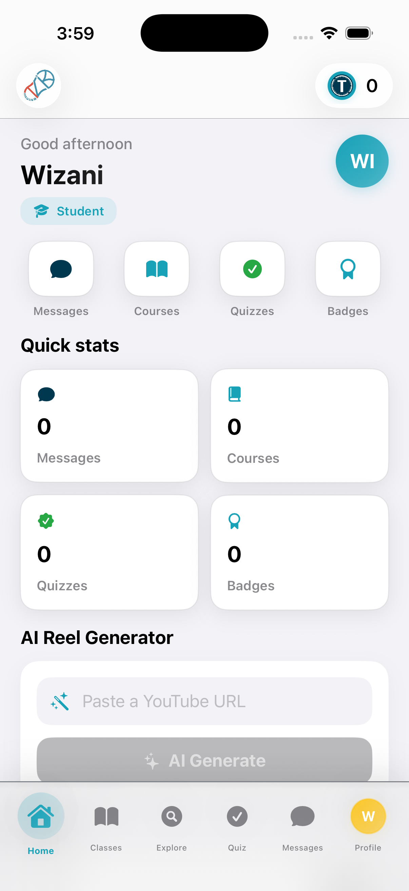</td>
      <td>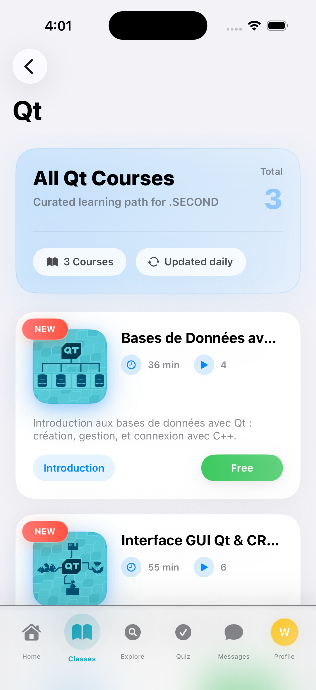</td>
      <td>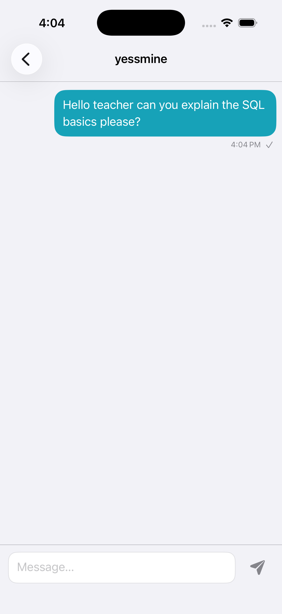</td>
      <td>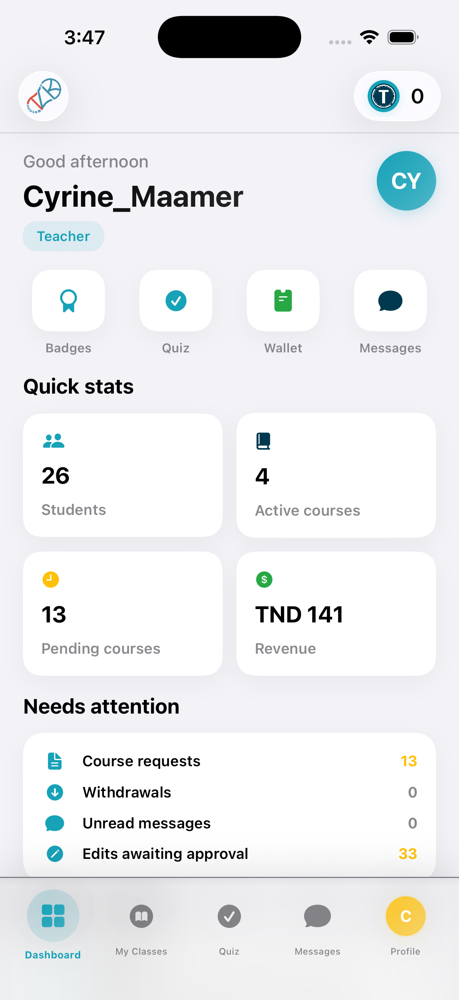</td>
      <td>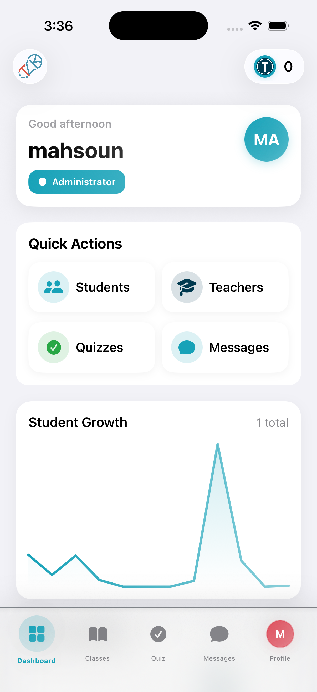</td>
    </tr>
  </table>
</div>

### 🧩 Student Features

<div style="overflow-x:auto;">
  <table>
    <tr>
      <td>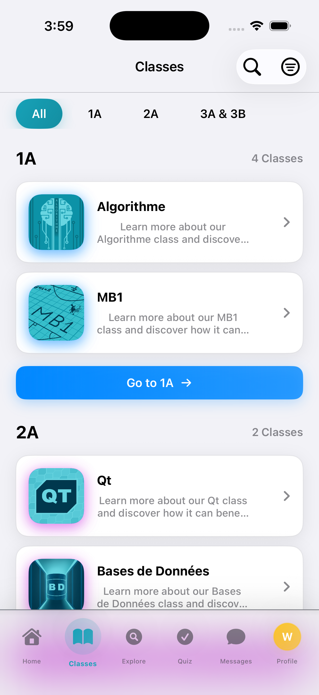</td>
      <td>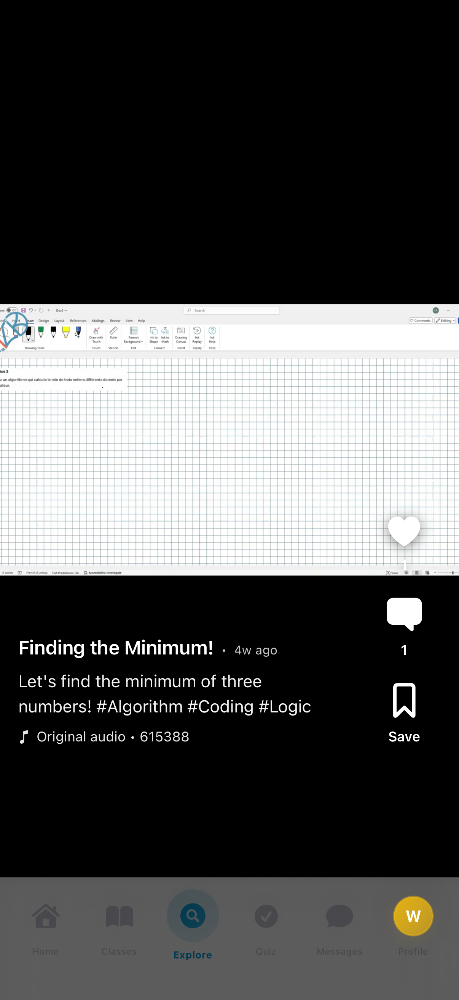</td>
      <td>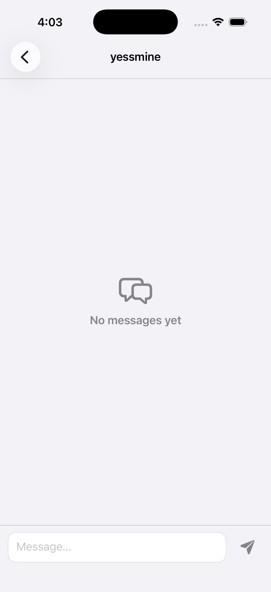</td>
      <td>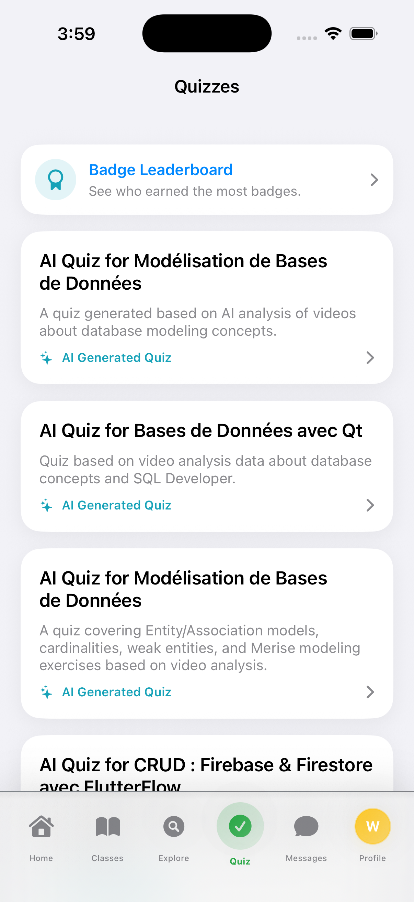</td>
      <td>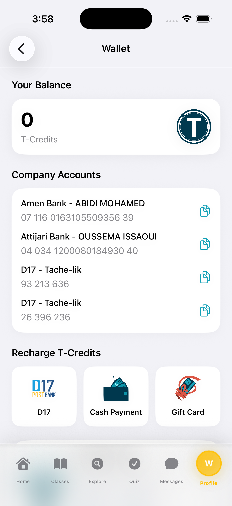</td>
      <td>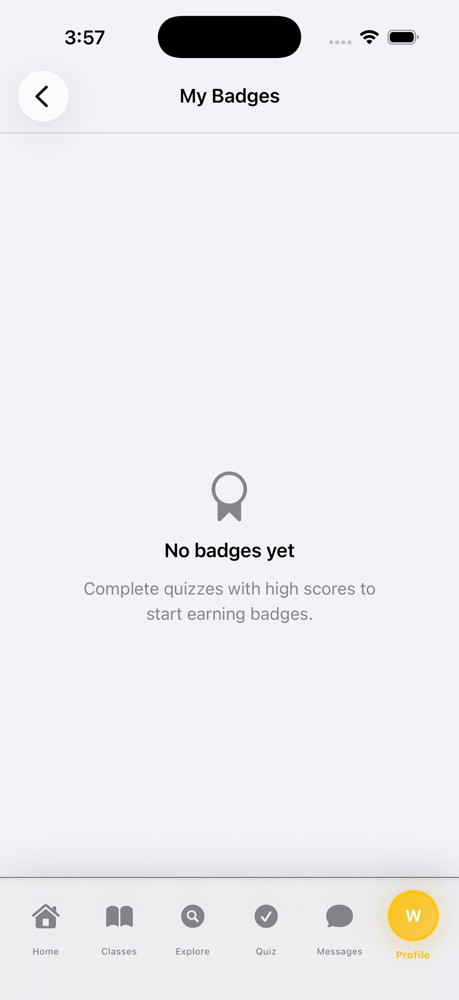</td>
    </tr>
  </table>
</div>

### 🧠 AI Experiences

<div style="overflow-x:auto;">
  <table>
    <tr>
      <td>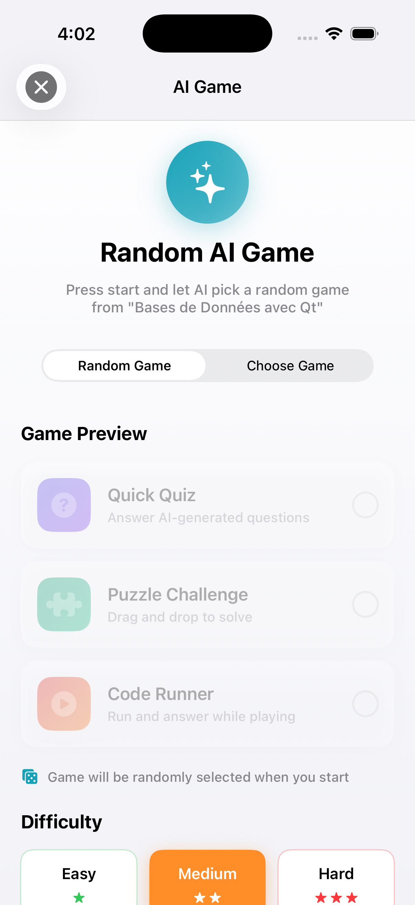</td>
      <td>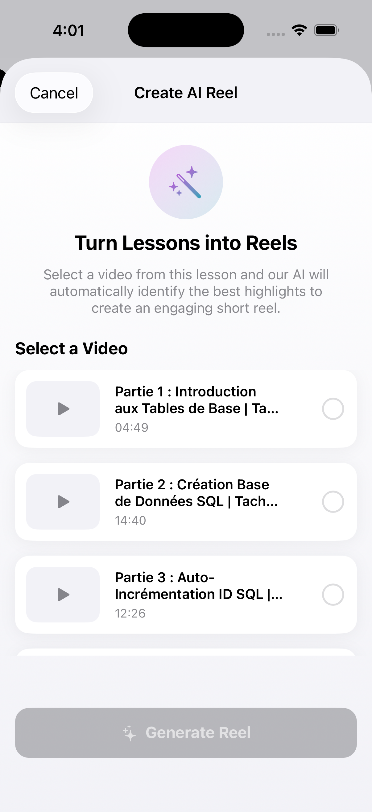</td>
      <td>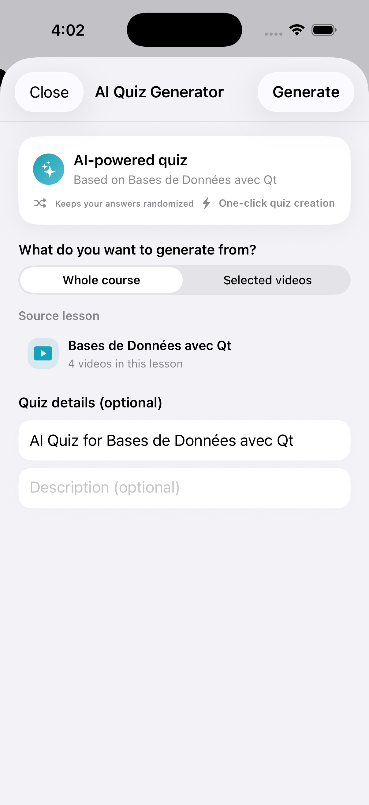</td>
    </tr>
  </table>
</div>

### 🧑‍🏫 Teaching Tools

<div style="overflow-x:auto;">
  <table>
    <tr>
      <td>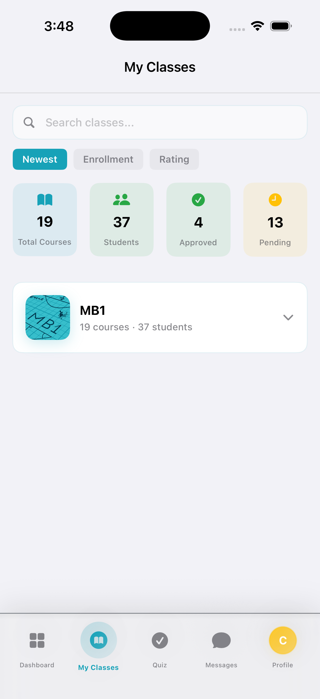</td>
    </tr>
  </table>
</div>

---

## 🛠️ Tech Stack

- **Language:** Swift
- **UI:** SwiftUI (UIKit bridging for navigation chrome where needed)
- **Architecture:** MVVM + Dependency Injection (`DIContainer`)
- **Networking:** `URLSession` + async/await (`NetworkService`)
- **Realtime:** Socket.IO (`SocketService`)
- **Persistence:**
  - Preferences and session flags: `AppStorage` / `UserDefaults`
  - Caches (non-sensitive): Caches directory (`HomeCacheStore`, `TeacherCourseContentCache`)
  - Core Data: stack scaffold (`PersistenceController`)
- **Testing:** XCTest (`projectDAMTests`)

---

## 🧠 Architecture

This project uses MVVM to keep screens **declarative**, state **testable**, and networking **centralized**.

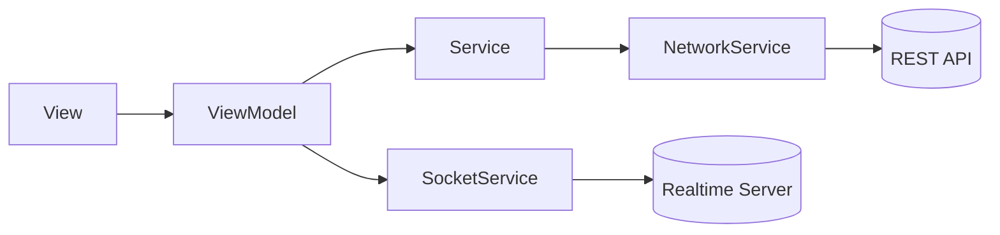

Key architecture properties:

- Clear View ↔ ViewModel ↔ Service separation
- Dependencies assembled in `DIContainer`
- Protocol-driven services support mocking in tests

---

## 📁 Folder Structure (Quick View)

```text
TacheLik_iosApp/
  projectDAM/
    Views/
    ViewModels/
    Services/
    DI/
    Theme/
    Utilities/ Utils/
    Models/
    Config/
    Assets.xcassets/
  projectDAMTests/
  Config.xcconfig
  Config.local.xcconfig
  screenshots/
```

---

## 🧭 Getting Started

### Prerequisites

- Xcode 15+ (recommended)
- iOS 15+ deployment target
- Backend API reachable from simulator/device

### Run

1. Open `projectDAM.xcodeproj` in Xcode.
2. Select the `projectDAM` scheme.
3. Run (⌘R).

---

## 🌍 Environment Configuration

This app uses **xcconfig** + **Info.plist** substitution.

- `Config.xcconfig`: default config (tracked)
- `Config.local.xcconfig`: local overrides (not committed)
- `projectDAM/Info.plist`: reads `API_BASE_URL` and `USE_MOCK_DATA`

Common setup:

- `API_BASE_URL`: `https://dev.api.tache-lik.tn/api`
- `USE_MOCK_DATA`: `false`

---

## 🔐 Security

Security posture is documented with a clear distinction between **current implementation** and **product-ready recommendations**.

- Token storage is currently `UserDefaults` (recommended: Keychain)
- ATS is currently permissive (recommended: tighten in Release)

---

## 📚 Documentation

Official product-ready documentation lives here:

- Documentation entry point: [Documentation/README.md](Documentation/README.md)

Additional developer/implementation notes (work-in-progress/internal) live here:

- Engineering notes entry point: [projectDAM/Docs/00_START_HERE.md](projectDAM/Docs/00_START_HERE.md)

Quick links:

- [Documentation/Project-Overview.md](Documentation/Project-Overview.md)
- [Documentation/Architecture.md](Documentation/Architecture.md)
- [Documentation/Networking.md](Documentation/Networking.md)
- [Documentation/Security.md](Documentation/Security.md)
- [Documentation/Testing.md](Documentation/Testing.md)

---

## 🏆 Our SDG Contributions

<div align="center">

| SDG Goal | Our Impact |
| --- | --- |
| **SDG 4 — Quality Education** | Mobile-first learning experiences, quizzes, and progress flows that promote consistent access to educational content. |
| **SDG 9 — Industry, Innovation & Infrastructure** | Scalable client architecture (MVVM + DI + services) enabling rapid feature evolution and maintainability. |
| **SDG 10 — Reduced Inequalities** | Cross-role access patterns and mobile usability improvements support broader access to learning services. |
| **SDG 12 — Responsible Consumption & Production** | Caching reduces unnecessary network usage and improves efficiency on constrained connections. |

</div>

### 🌱 Sustainability Initiatives

- Efficient caching to reduce repeated requests
- Lightweight networking patterns and controlled logging in Debug only
- UI designed to stay usable in low-connectivity conditions

---

## 🛠️ Advanced Technology Stack

This repository represents a broader product ecosystem beyond iOS. The following stack reflects the wider platform technologies used across the project.

<div align="center">
  
</div>

Aligned with the codebase:

- **iOS:** Swift + SwiftUI (MVVM + DI), URLSession async/await, Socket.IO
- **Web:** React (socket.io-client, axios)
- **Backend:** Node.js + TypeScript (Express, Socket.IO, TypeORM)
- **Data/Infra:** MySQL, Redis, Nginx

---

## 🔗 Related Repository

- Android app: https://github.com/HamaBTW/TacheLik_androidApp

---

## 👨‍💻 Team & Contributors

<table align="center">
  <tr>
    <td align="center" width="180">
      <a href="https://github.com/fekikarim">
        
      </a>
      <br />
      <b>Karim Feki</b>
      <br />
      <a href="https://www.linkedin.com/in/karimfeki/" title="LinkedIn">
        
      </a>
      &nbsp;
      <a href="https://github.com/fekikarim" title="GitHub">
        
      </a>
      &nbsp;
      <a href="mailto:feki.karim28@gmail.com" title="Email">✉️</a>
    </td>
    <td align="center" width="180">
      <a href="https://github.com/nesrine77">
        
      </a>
      <br />
      <b>Nesrine Derouiche</b>
      <br />
      <a href="https://www.linkedin.com/in/nesrine-derouiche/" title="LinkedIn">
        
      </a>
      &nbsp;
      <a href="https://github.com/nesrine-derouiche" title="GitHub">
        
      </a>
      &nbsp;
      <a href="mailto:nesrine.derouiche15@gmail.com" title="Email">✉️</a>
    </td>
    <td align="center" width="180">
      <a href="https://github.com/hamabtw">
        
      </a>
      <br />
      <b>Mohamed Abidi</b>
      <br />
      <a href="https://www.linkedin.com/in/med-abidi/" title="LinkedIn">
        
      </a>
      &nbsp;
      <a href="https://github.com/hamabtw" title="GitHub">
        
      </a>
      &nbsp;
      <a href="mailto:abidi.mohamed.1@esprit.tn" title="Email">✉️</a>
    </td>
    <td align="center" width="180">
      <a href="https://github.com/oussemissaoui">
        
      </a>
      <br />
      <b>Oussema Issaoui</b>
      <br />
      <span title="LinkedIn">—</span>
      &nbsp;
      <a href="https://github.com/oussemissaoui" title="GitHub">
        
      </a>
      &nbsp;
      <a href="mailto:oussema.issaoui@esprit.tn" title="Email">✉️</a>
    </td>
  </tr>
</table>

### 🙏 Mentor

Special thanks to our mentor **Khaled Guedria** for the guidance, feedback, and great mentoring throughout the project:

- https://github.com/khaledGuedria17

### 📇 Contacts

| Name | LinkedIn | GitHub | Email |
|---|---|---|---|
| Karim Feki | <a href="https://www.linkedin.com/in/karimfeki/" title="LinkedIn"></a> | <a href="https://github.com/fekikarim" title="GitHub"></a> | <a href="mailto:feki.karim28@gmail.com" title="Email">✉️</a> |
| Nesrine Derouiche | <a href="https://www.linkedin.com/in/nesrine-derouiche/" title="LinkedIn"></a> | <a href="https://github.com/nesrine-derouiche" title="GitHub"></a> | <a href="mailto:nesrine.derouiche15@gmail.com" title="Email">✉️</a> |
| Mohamed Abidi | <a href="https://www.linkedin.com/in/med-abidi/" title="LinkedIn"></a> | <a href="https://github.com/hamabtw" title="GitHub"></a> | <a href="mailto:abidi.mohamed.1@esprit.tn" title="Email">✉️</a> |
| Oussema Issaoui | — | <a href="https://github.com/oussemissaoui" title="GitHub"></a> | <a href="mailto:oussema.issaoui@esprit.tn" title="Email">✉️</a> |

---

## 📬 Support

- For iOS issues: open a GitHub issue and include iOS version + device + reproduction steps.
- For API issues: verify `API_BASE_URL` first and share endpoint + response status.

---

## 📦 License

This project is released under the **MIT License**. See [LICENSE](LICENSE).

---

<div align="center">
  <sub><i>Keep learning. Keep building. Keep shipping.</i></sub>
</div>


